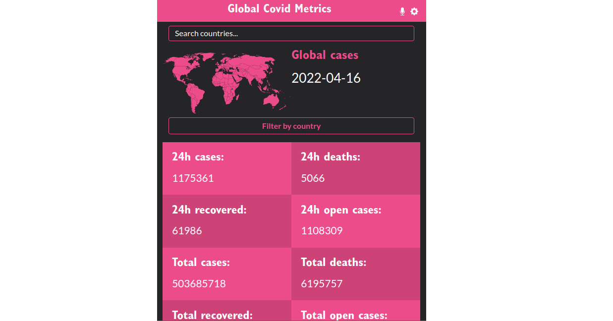

# Global Covid Metrics

> A React web app that renders global covid metrics with filter functions.




**This is a web App built with React-Redux that allows users to:**
- Visualize last 24h global covid statistics.
- Filter stats by continent.
- Filter stats by country.
- Filter stats by regions (if available).
- Search country stats by name.

**Features:**
- Advanced Routing: every page and item has its own path.
- Country shapes are available for most countries.
- Optimized for mobile devices.


## Built With

- HTML
- CSS
- React-Bootstrap
- Sass
- JavaScript
- React
- Redux
- [REST API](https://covid19tracking.narrativa.com/index_en.html)

## Live Page

[Click Here](https://covid-metrics-helio.herokuapp.com/)

[Click Here](https://covid-metrics-helio.netlify.app/)


## Getting Started

To get a local copy up and running follow these simple steps.

### Prerequisites

- Have git correctly installed.
- Have NPM and NodeJs correctly installed.

### Setup

- Open a terminal window where you want to have installed a copy of the repository.

### Install

- Use this command to clone the repo:
```
$ git clone git@github.com:helio3197/covid-metrics.git
```
- Install the required dependencies:
```
$ npm install
```
### Usage

- Run:
```
$ npm start
```
- Build:
```
$ npm run build
```
- Testing:
```
$ npm test
```
- Edit the content as you like.


## Authors

👤 **Kenny Salazar**

- GitHub: [@helio3197](https://github.com/helio3197)
- Twitter: [@kennysalazar31](https://twitter.com/kennysalazar31)
- LinkedIn: [LinkedIn](https://linkedin.com/in/kenny-salazar-1a1687110)


## 🤝 Contributing

Contributions, issues, and feature requests are welcome!

Feel free to check the [issues page](../../issues/).

## Show your support

Give a ⭐️ if you like this project!

## Acknowledgments

- Thanks to Microverse for the guidelines.


## 📝 License

This project is [MIT](./MIT.md) licensed.
